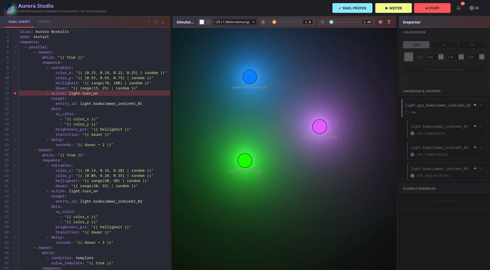

# Aurora Studio
**Design and simulate light animations – tailor-made for Home Assistant.**  
*Licht-Animationen entwerfen und simulieren – maßgeschneidert für Home Assistant.*

---

Aurora Studio is a modern IDE for creating and simulating complex Home Assistant light scripts. It allows developers to visualize animations in real-time without needing to switch actual hardware.



### Features

- **Real-time Simulation:** Experience your YAML scripts visually and instantly. Supports `Nunjucks/Jinja2` for variables and logic.
- **Color Picker:** Precise color selection in **RGB**, **XY** (Zigbee/Philips Hue standard), and **HS** (Hue-Saturation).
- **YAML Editor:** Full-featured editor (CodeMirror) with syntax highlighting, autocomplete optimization, and YAML validation.
- **Node Editor:** Node-based editor to quickly build complex scripts with minimal knowledge of the YAML language.
- **Entity Management:** Organize your lights into groups. Intuitive grouping via Drag & Drop (Desktop) or Long-Press (Mobile).
- **Multilingual:** Full support for **German** and **English** – easily expandable with other languages.
- **Responsive Design:** Optimized for desktop and mobile devices (including touch gestures).
- **Debug Mode:** Integrated error tracking and notification system for script debugging, support for breakpoints and inspection of variables.
- **Support for other device types:** While Aurora Studio is mainly made for light simulations, it also supports some other devices like shutters and fans with simple animations.

### 🛠️ Tech Stack

- **Core:** HTML5, CSS3 (Vanilla), JavaScript (ES6 Modules)
- **Parser:** [js-yaml](https://github.com/nodeca/js-yaml) & [Nunjucks](https://mozilla.github.io/nunjucks/) (for Jinja2 templates)
- **Editor:** [CodeMirror 5](https://codemirror.net/5/)
- **Branding:** Independent design system (Dracula-inspired) to ensure legal separation from Home Assistant.

### Installation & Getting Started

Since Aurora Studio is designed as a pure client-side web app, no complex installation is required.

**Launch the Web App directly via GitHub Pages:** [Aurora Studio](https://b3n1ce.github.io/AuroraStudio/)

#### Running Locally
Alternatively, you can clone the repository and host a local webserver (running the `index.html` directly from your file system does not work due to security limitations/CORS in modern browsers).

You can easily spin up a local server using Python or Node.js:

```
bash

# Using Python
python -m http.server 8000

# Using Node.js (npx)
npx serve .
```

### Usage
The Workflow

**Scripting:** Write your YAML script in the left panel.
**Simulation:** Click ▶ Start at the top. The lights in the middle panel will react instantly to your commands.
**Inspector:** Use the right panel to find colors, check variables, or group entities.
**Export:** Save your finished script directly as a .yaml file for your Home Assistant /config/scripts.yaml.

Pro Tips
**Labels:** Use the T icon in the simulation to toggle entity names on and off.
**Entity Visibility:** You can turn off the light simulation for individual entities in the inspector, or toggle the entire color overlay with the eye icon in the header menu.
**Color Curves:** Choose between _Linear_, _Gamma 2.2_, _Gamma 2.8_, or _CIE L*_ profiles for realistic color reproduction.
**Ambient Light & Intensity:** The two sliders in the header control the amount of ambient light affecting the background and the general intensity of the light outputs.

###Built with AI (Vibe Coded)

This project is built with heavy usage of AI. While it has been tested and refined to simulate Home Assistant scripts as accurately as possible, there might still be some edge cases, unhandled Jinja2 templates, or performance bottlenecks.

If you encounter any weird behavior, freezing, or parsing errors, feel free to open an Issue or a Pull Request to help improve the simulation logic.

_This project was built in my free time to help the HA Community (and myself)._

### Legal Disclaimer

This project is not officially affiliated with Home Assistant or Nabu Casa Inc.. The term "Home Assistant" is used descriptively solely to indicate compatibility of the generated scripts.
